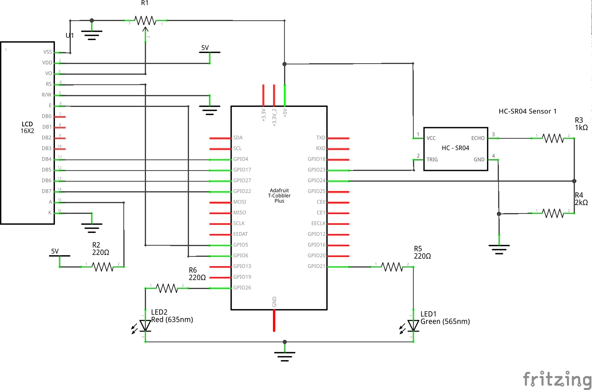

# Parking Sensor:

This is the hardware component for my Capstone 2 project.

Using a [Raspberry Pi 3][rpi3] with an attached [Ultrasonic Sensor (HC-SR04)][ultrasonic-sensor] it sends a PUT request to the [Parking Api][api] if the current distance of target vehicle is close or less than the set distance in an `.env` file.

It also shows the current distance of the target through an [LCD][display].

# Schematic

# Materials Used

* [Raspberry Pi 3][rpi3]
* [T-Cobbler][cobbler]
* 1x 10K ohms potentiometer (R1) (I've used a Rotary Potentiometer)
* 3x 220 ohms resistor (R2, R5, R6)
* 1x Breadboard (I've used 2 since I needed more space)
* 1x 1k ohms resistor (R3)
* 1x 2k ohms resistor (R4)
* 2x LED (Blue & Red)
* [LCD Display][display]
* [HC-SR04 Ultrasonic Sensor][ultrasonic-sensor]

# Environment Settings used

    LOT_ID= // corresponding parking lot id of this sensor
    HOST= // host url of api
    PORT= // port of api

    // LCD Ports for displaying current distance of target
    RS=
    E=
    DB4=
    DB5=
    DB6=
    DB7=

There are two LEDs that signal whether (hypothetically) the lot is vacant or occupied.

* Led at Pin 21 (Vacant)
* Led at Pin 26 (Occupied)

![The Device in Action][gif]

Libraries used:

* [Pigpio][pigpio] 
* [Lcd][lcd]
* [Axios][axios] 

[lcd]: https://github.com/fivdi/lcd
[ultrasonic-sensor]: https://www.adafruit.com/product/3942
[pigpio]: https://github.com/fivdi/pigpio
[axios]: https://to-be-added
[gif]: assets/in-action.gif
[rpi3]: https://www.raspberrypi.org/products/raspberry-pi-3-model-b/
[api]: https://github.com/Pofay/parking-app-api
[cobbler]: https://www.adafruit.com/product/2028
[display]: https://www.amazon.com/lcd-display-16x2/s?page=1&rh=i%3Aaps%2Ck%3Alcd%20display%2016x2
